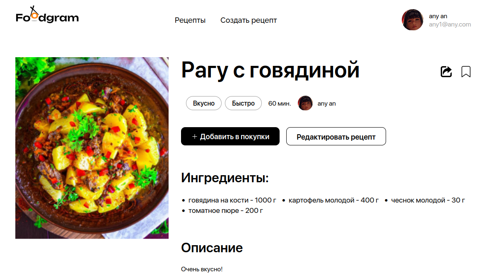

# Живи ярко! Ешь вкусно! Делись рецептами и узнавай новые! 
# Сайт `Foodgram` для тебя! :spaghetti:
***

__Используемые технологии__
- Docker, Docker Compose
- Postgresql
- Nginx
- Django, Django REST Framework
***
__Для кого этот сайт__
> Для тех, кто хочет предоставить пользователям сервис для размещения рецептов, обмена ими, для тех кто хочет использовать его как старт своего проекта, который будет развиваться в нужном Вам направлении.

__Первый запуск__
> Для запуска проекта находясь в папке infra введите в консоле `docker compose up`. Файл `docker-compose.product.yml` используется для развертывания на сервере. Для работоспособности проекта необходим файл `.env` или `.env-product` (в зависимости от того на какой стадии разработки вы находитесь) в директории infra. Его образец находится в файле `example.env` - заполните его своими данными.

__Используемые технологии__
> В проекте используется _Git Action_ для DevOps практики CI/CD. Образы необходимые для работы на сервере расположены на DockerHub.

> Frontend часть выполнена на React[^1] и представляет из себя SPA[^2]

> Backend с помощью Django и Django RestFramework.
***
### Визуальный пример сайта.

***

[^1]:JavaScript-библиотека с открытым исходным кодом для разработки пользовательских интерфейсов.
[^2]:SPA — полноценное приложение, которое работает в браузере пользователя. 
